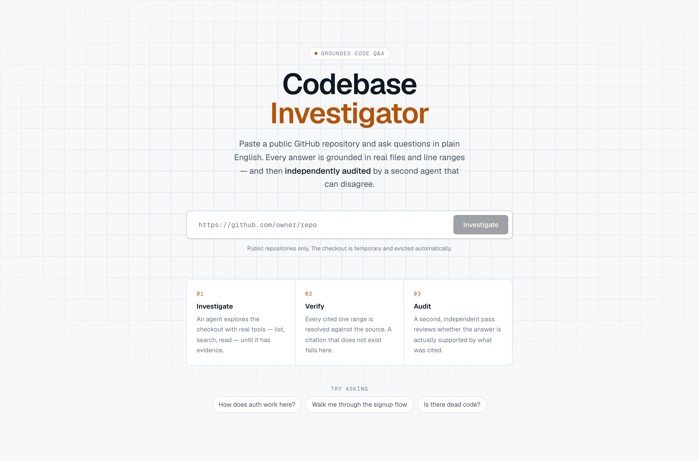
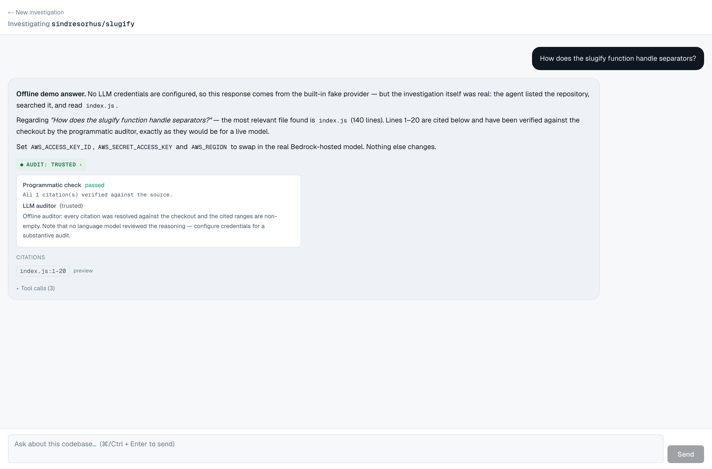
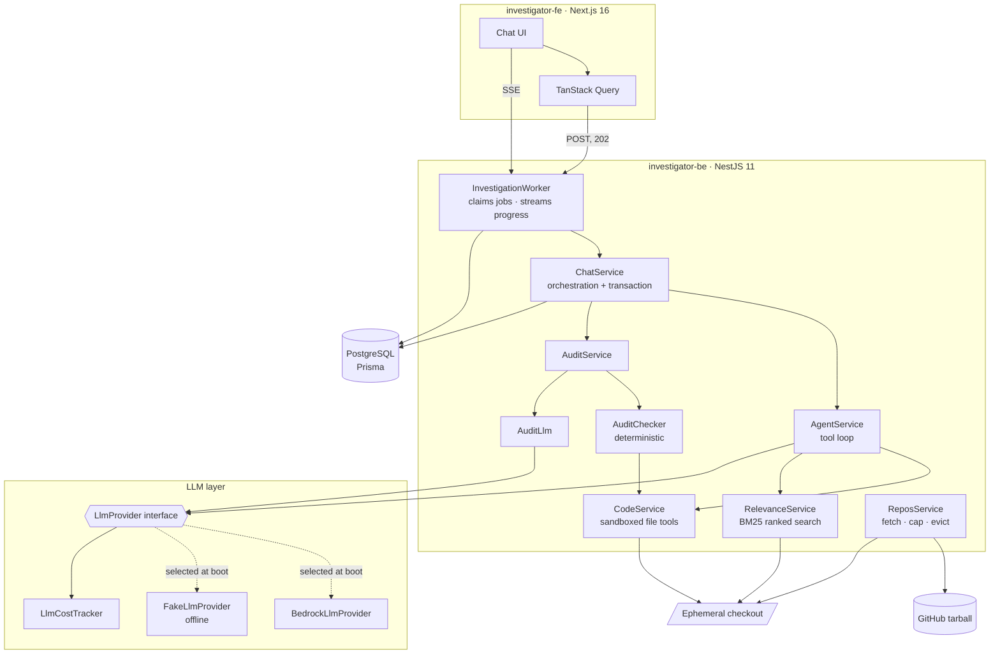
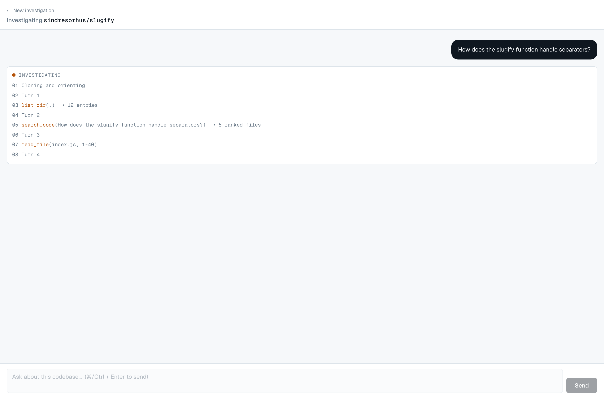

# Codebase Investigator

Paste a public GitHub URL, ask questions about the code in plain English, and get
answers grounded in specific files and line ranges — where **every non-trivial
answer ships with an independent audit verdict**.

The interesting part is not the chat. It is that a second agent reviews the first
one's work and is allowed to disagree with it, and that a deterministic checker
resolves every cited line range against the actual checkout before either agent's
opinion counts for anything.



---

## Run it

```bash
docker compose up --build
```

Then open **http://localhost:3100**. The API is on **http://localhost:4000/api**,
with Swagger at **/api/docs**.

**No credentials are required.** With no AWS keys present the API selects its
offline LLM provider, which drives the same agent loop against the real checkout
and cites real lines — so a fresh clone is fully demonstrable with one command.
See [Running without credentials](#running-without-credentials) for what that
does and does not prove.

To use a live model, copy `investigator-be/.env.example` to `.env`, fill in the
AWS values, and restart. Nothing else changes.

<details>
<summary>Running without Docker</summary>

```bash
# Postgres must be reachable at the DATABASE_URL in your .env
cd investigator-be
npm ci
cp .env.example .env
npx prisma migrate deploy
npm run start:dev            # :4000

cd ../investigator-fe
npm ci
cp .env.example .env
npm run dev                  # :3000
```
</details>

---

## What happens when you ask a question

```mermaid
sequenceDiagram
    autonumber
    actor U as User
    participant API as NestJS API
    participant AG as Investigator agent
    participant TL as Code tools
    participant CK as Citation checker
    participant AU as Auditor agent
    participant DB as PostgreSQL

    U->>API: POST /sessions { githubUrl }
    API->>API: Stream tarball, cap size, strip unsafe entries
    API-->>U: session id

    U->>API: POST /sessions/:id/messages { content }
    API->>DB: Enqueue job
    API-->>U: 202 Accepted + jobId
    U->>API: GET /jobs/:id/events (SSE)

    Note over API,AG: A worker claims the job; the request is already done
    API->>DB: Persist user message

    loop up to 12 turns
        AG->>TL: search_code / read_file / grep / list_dir / find_files
        TL-->>AG: Results, confined to the repo root
        AG-->>U: progress event (SSE)
    end
    AG-->>API: submit_answer + citations

    API->>CK: Resolve each cited range against the checkout
    CK-->>API: pass / fail, per citation

    API->>AU: Question, answer, verified excerpts
    AU-->>API: trusted | partial | suspect + reasons

    Note over API: Final verdict is the worse of the two
    API->>DB: Message + citations + verdict (one transaction)
    API-->>U: done event -> client refetches the message
```

The final verdict is deliberately the **worse** of the deterministic result and
the model's opinion. A confident auditor cannot upgrade an answer whose citations
do not resolve.



---

## Architecture



### Why investigations are queued, not awaited

A question costs several sequential model round-trips plus an audit pass. Held
open inside the HTTP request, that regularly exceeded the 30–60 second idle
timeout of any proxy in front of the service — so the client saw a dead
connection while the work carried on invisibly.

Now the request enqueues and returns `202` in milliseconds, and a worker claims
the job with `SELECT ... FOR UPDATE SKIP LOCKED`. That choice matters: job state
lives in Postgres rather than process memory, so a restart does not lose
in-flight work, several API instances can share one queue without extra
infrastructure, and a worker killed mid-run has its job reclaimed after a
timeout. Progress is both persisted and broadcast, so a client that reconnects
replays everything it missed.

The visible payoff is that the UI shows the agent working:



### Why the LLM sits behind an interface

Every model call goes through `LlmProvider` rather than a vendor SDK. That single
seam is what makes the rest possible:

| Without it | With it |
|---|---|
| Tests need AWS credentials | 50 tests run offline in under a second |
| A fresh clone cannot be demoed | `docker compose up` and it works |
| Adding a vendor means editing the agent | Adding a vendor is one new file |
| Token spend is invisible | Every call is priced and reported |

Provider selection happens once, at boot, in `llm.module.ts`: an explicit
`LLM_PROVIDER` env var wins; otherwise the presence of AWS credentials decides;
otherwise the offline provider is used and the reason is logged.

---

## Running without credentials

The offline provider is not a stub that returns a canned string. It runs the same
investigation as the real agent — orient, rank, read, answer — by parsing the
tool results already in the transcript and choosing its next move from what it
actually observed.

Because its citations are built from line ranges it genuinely read, the
deterministic checker verifies them for real. The screenshot above is the offline
provider: `4 tool calls`, a citation to `index.js:1-20`, and a **trusted** verdict
earned by passing verification.

**What this proves:** the agent loop, tool dispatch, path sandboxing, citation
verification, audit aggregation, persistence and UI all work end to end.

**What it does not prove:** answer quality. No model reasoned about the code. The
offline auditor says so in its own verdict text rather than quietly claiming a
clean bill of health.

---

## Retrieval

The agent has five tools. Four are exact-match — `list_dir`, `read_file`,
`grep` (literal string), `find_files` (path substring) — and they all fail the
same way: when the question's vocabulary differs from the code's. Asking about
"authentication" finds nothing in a repository whose file is `auth.ts`.

`search_code` closes that gap. It ranks whole files with BM25 over
identifier-aware tokens, splitting `issueToken` into `issue` and `token` and
treating a shared four-character prefix as a shared root, so "authentication"
reaches `auth.ts`. A filename hit is weighted heavily, because naming a file
`auth.ts` is stronger evidence than one mention in a comment.

It is deliberately lexical rather than dense. BM25 needs no model, no network
and no credentials, so it runs in CI and in the offline demo; and on code —
short, keyword-dense, full of exact identifiers — it is a strong baseline rather
than a compromise. `RelevanceService.rank()` is the seam if dense retrieval is
wanted later: inject an embedding provider and blend the scores.

## Evaluation

An LLM feature whose quality nobody measures is a guess. `npm test` scores the
investigator against a fixture repository with known answers:

```
eval: provider=fake pass=3/3 recall=1 precision=1 p95=7ms usd=0
```

| Metric | Meaning |
|---|---|
| `citationRecall` | Did it cite the files that actually answer the question |
| `citationPrecision` | Did its citations resolve against the source |
| `verdict` | The audit standing each answer earned |
| `p95`, `usd` | Latency and spend per question |

The graders are deterministic — no model judges another model's output, so a
score change means a real change in the system. The suite fails if precision
drops below 1.0 (the agent invented a line range) or recall below 0.66 (it
stopped finding the right file).

This is not decoration. The first run scored **2/3, recall 0.67**: asked about
"authentication tokens" it cited the rate limiter, because that file is a *token
bucket* and says "tokens" far more often than `auth.ts` does. Stem expansion
fixed it. That regression would have been invisible without a score.

---

## Security

The system executes an agent's file operations against **an untrusted archive
downloaded from the internet**, so containment is a core requirement rather than
a hardening pass.

| Risk | Control |
|---|---|
| `../` traversal | Lexical rejection before any filesystem call |
| **Symlink escape** — a repo containing `docs/x -> /etc/passwd` | `realpath()` on every resolved path, re-checked for containment; directory walks skip symlinks; ripgrep runs `--no-follow` |
| Malicious archive entries | `tar` filter accepts only regular files and directories, and rejects absolute or `..` paths |
| Disk exhaustion | Archive stream aborted past 150 MB; clones evicted hourly past a 6-hour TTL |
| Budget exhaustion | Rate limiting at 20 req/min and 200 req/hour |
| Partial writes | Message, citations and verdict commit in one transaction |

A string-only path check is the subtle one, and it is why `code.security.spec.ts`
builds a real symlink pointing outside a real temp repo and asserts the read is
refused.

---

## Layout

```
codebase-investigator/
├── investigator-be/          NestJS API
│   ├── src/agent/            Tool loop, tool schemas, prompts
│   ├── src/audit/            Deterministic checker + LLM auditor
│   ├── src/code/             Sandboxed list/read/grep/find
│   ├── src/llm/              Provider interface, Bedrock, offline, cost
│   ├── src/repos/            Archive fetch, size cap, TTL eviction
│   ├── src/chat/             Orchestration and the write transaction
│   ├── src/jobs/             Queue, worker, SSE progress
│   ├── src/eval/             Scored evaluation harness
│   └── prisma/               Schema and migrations
└── investigator-fe/          Next.js App Router chat UI
```

## Tech stack

**Backend** NestJS 11 · TypeScript · Prisma 6 · PostgreSQL 17 · Anthropic on AWS
Bedrock · Jest · Swagger
**Frontend** Next.js 16 (App Router) · React 19 · TanStack Query v5 · Tailwind v4
**Infrastructure** Docker Compose · multi-stage builds · non-root containers ·
healthchecks

## Tests

```bash
cd investigator-be && npm test
```

50 tests, no network and no credentials. The suite covers the offline provider's
transcript parsing, the containment guarantees above, BM25 ranking, citation
verification, GitHub URL parsing, and the scored evaluation.

## Configuration

Every variable is documented in `investigator-be/.env.example`, and all of them
have working defaults. The ones worth knowing:

| Variable | Default | Purpose |
|---|---|---|
| `LLM_PROVIDER` | auto | Force `fake` or `bedrock` regardless of credentials |
| `AWS_ACCESS_KEY_ID` etc. | empty | Present ⇒ live model; absent ⇒ offline provider |
| `DATABASE_URL` | compose value | Postgres connection |
| `LLM_PRICE_INPUT_PER_MTOK` | `3.0` | Cost estimation, USD per million tokens |
| `FAKE_LLM_DELAY_MS` | `600` in compose | Paces the offline demo so the progress stream is readable; `0` in tests |
| `WORKER_CONCURRENCY` | `2` | Investigations run in parallel per instance |

## Known limitations

- **No authentication.** Rate limiting bounds abuse, but anyone who can reach the
  API can start a session.
- **Retrieval is lexical, not semantic.** BM25 with stem expansion handles
  vocabulary drift well, but a question that shares no word root with the code
  ("how do we stop abuse?" → `rateLimit.ts`) still depends on the model
  choosing good search terms. Dense retrieval is the next step, and
  `RelevanceService.rank()` is where it goes.
- **The eval scores the offline path.** It is a genuine regression gate on the
  tools, the transcript format and the citation checker. Scoring answer
  *quality* needs a live provider, which needs credentials.
- **One queue, in-process workers.** The `SKIP LOCKED` design scales to several
  API instances as-is, but there is no dead-letter queue and no retry backoff
  beyond the claim timeout.
